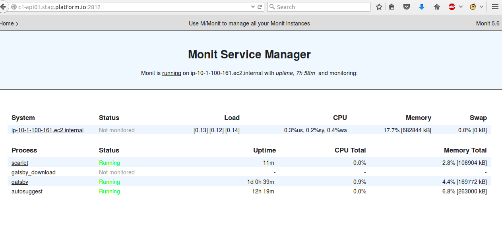

## README

Easy proactive monitoring of unix system processes. Monit reads its config from monitrc file.
Some important things are:
* Daemon cycle - when monit is running in daemon mode ( usually ) it will get up after sleeping for *t* seconds
  as specified under **set daemon <monit_cycle>**
* monit gui runs on port 2812. The username and password to access it are:
  **admin** and **monit**. Access from any machine in the entire CIDR block is enabled by setting monit_cidr_block
  variable.

  

Some useful commands:
* monit -t - syntax check of monit file
* monit monitor <process_name> - sync
* monit unmonitor <process_name> - sync
* monit start <process_name> - async
* monit stop <process_name> -async
* monit status
* monit start all
